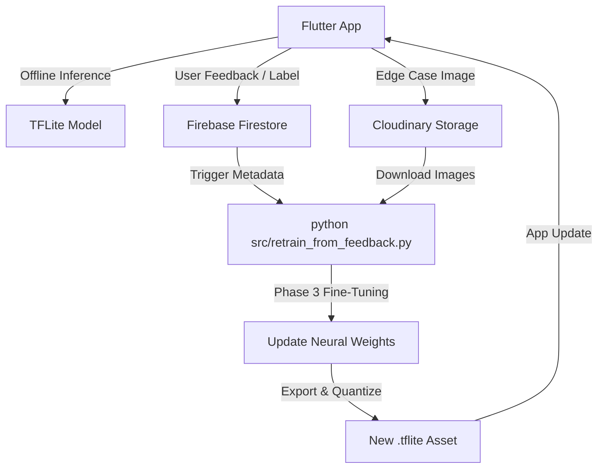

# 🌿 Crop Doctor — AI Plant Disease Detection

<div align="center">

**Production-grade Android app that detects 38 plant diseases across 14 crops using on-device AI. Works fully offline.**

[](https://flutter.dev)
[](https://tensorflow.org)
[](https://firebase.google.com)
[](https://cloudinary.com)
[](https://android.com)

</div>

---

## 🌐 Landing Page

[**👉 Click here to open the live landing page**](https://omdhanawat.github.io/Crop-Doctor-AI-Based-Plant-Disease-Detection/)

The project includes a premium, responsive landing page to showcase the application, features, and supported crops. Deployment is handled via GitHub Pages pointing to the `/docs` folder.

---

## 📊 Model Performance

### Core Model — Smart Mixed Training v2.0

Factual metrics extracted from the latest training logs (`models/smart_train_report.json`):

| Dataset | Images Tested | Accuracy |
|---|---|---|
| PlantVillage (Clean Lab) | 54,305 | **99.18%** |
| Real-world photos (Mixed) | 13,857 | **94.13%** |

### Model Evolution

| Version | Strategy | PV Accuracy | Real-world Accuracy |
|---|---|---|---|
| v1.0 | PlantVillage Only | 98.80% | ~45% |
| v1.1 | Real Images (Naive Injection) | 66.83% | 78.88% |
| **v2.0** | **Smart Mixed Weighted Training** | **99.18%** | **94.13%** |

---

## 🏗️ Architecture

### 2-Stage Cascaded Inference Pipeline
The application uses a high-performance, double-validation pipeline to ensure edge-case robustness:

1. **Stage 1: Leaf Detector (`leaf_detector.tflite`)**
   - **Architecture:** MobileNetV2 Binary Classifier.
   - **Input:** 224x224x3 (Normalized -1 to 1).
   - **Purpose:** Acts as a gatekeeper. If the confidence of "Leaf" is below 50%, the process terminates, preventing false classifications on hands, background, or equipment.
   
2. **Stage 2: Disease Classifier (`disease_model.tflite`)**
   - **Architecture:** MobileNetV2 38-class Classifier.
   - **Input:** 224x224x3 (Normalized -1 to 1).
   - **Optimization:** INT8 Weight Quantization (9.77MB).
   - **Logic:** Performs granular diagnosis only if Stage 1 passes.

### System Architecture & Cloud Feedback Loop



---

## 🗂️ Project Structure

```text
Crop_Disease_Predection/
├── crop_disease_app/          # Flutter Cross-Platform Client
│   ├── lib/
│   │   ├── screens/           # UI Layers (Camera Scan, Results)
│   │   └── services/          # TFLite Inference & Cloud Sync logic
│   └── assets/models/         # Compiled edge models (.tflite)
├── src/                       # ML & DL Training Pipeline
│   ├── smart_mixed_train.py   # Weighted Weighted Dataset Fusion
│   ├── retrain_from_feedback.py # Automated Cloud Data Ingestion
│   └── recompose.py           # Background Augmentation Engine
├── models/                    # Validated Checkpoints & Training Reports
├── docs/                      # Responsive Web Page (index.html)
└── requirements.txt           # ML Pipeline dependencies
```

---

## 🚀 Quick Start (Machine Learning)

### 1. Environment Setup
```bash
pip install -r requirements.txt
```

### 2. Run Training Pipeline
To retrain or fine-tune the model with real-world weighting:
```bash
python src/smart_mixed_train.py
```

### 3. Continuous Learning Ingestion
To fetch user-validated images from the cloud and prepare for Phase 3 training:
```bash
python src/retrain_from_feedback.py --count-only
```

---

## ⚙️ Requirements

- **Inference:** Android 6.0+ (Architecture arm64-v8a optimized).
- **Training:** Python 3.9+, TensorFlow 2.10+, 8GB RAM minimum.

---

<div align="center">

**Built for sustainable agriculture. Factual. Fast. Free.**

[🌐 Open Live Landing Page](https://omdhanawat.github.io/Crop-Doctor-AI-Based-Plant-Disease-Detection/) • [⭐ Star this project](https://github.com/omdhanawat/Crop-Doctor-AI-Based-Plant-Disease-Detection)

</div>
